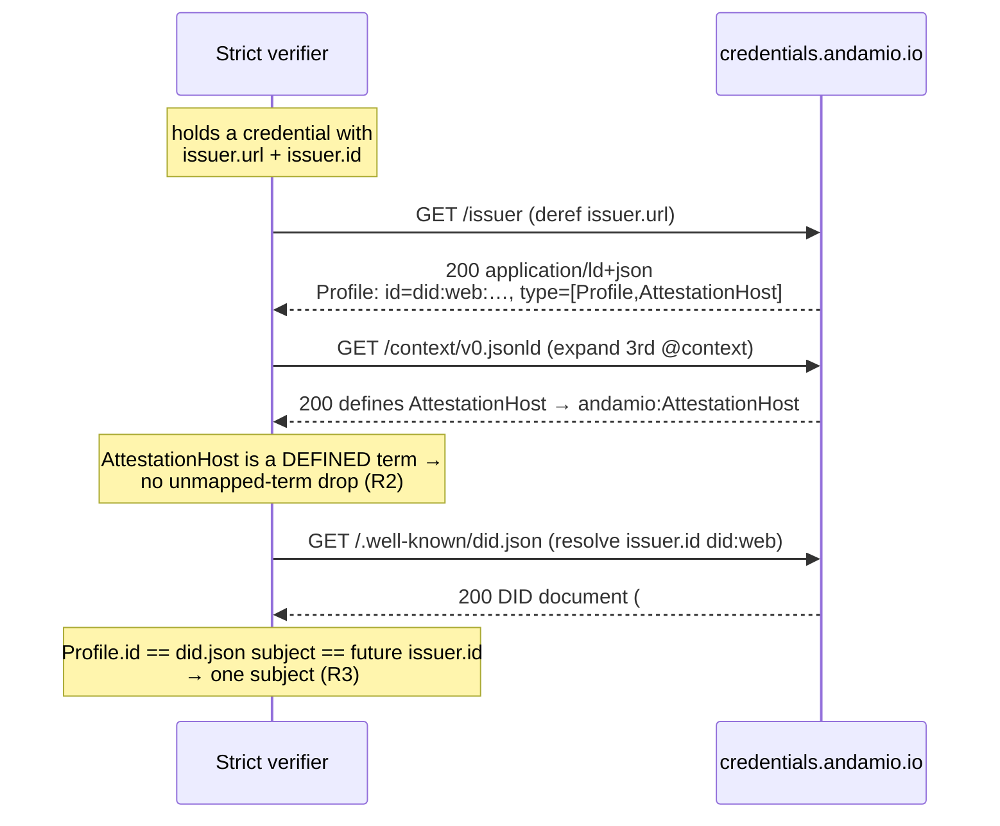

# feat: Rung 4 — Issuer Profile = AttestationHost

## Summary

Promote the production hosted issuer Profile (`/issuer` → `issuer/profile.jsonld`) to the exact `["Profile","AttestationHost"]` shape the Rung-1 verifier spike already proved passes **spruce (VALID, 0/0)** and the **1EdTech public validator**. Three coupled edits carry the shape into production: add the `AttestationHost` term to the served JSON-LD context, apply the attestation-host `type`/`description` to the Profile, and flip the Profile `id` from the URL to `did:web:credentials.andamio.io` (which resolves as of Rung 3). Two supporting edits keep the trust gate and docs honest: extend CODEOWNERS to the newly trust-critical files and update the `/issuer` rows in README/MOC. A durable invariant test pins the shape against drift.

The change is additive and low-risk: **nothing signs against this Profile yet**, so a stale cache or a revert is harmless. This plan explicitly excludes everything about signing, the `evidence` field, `credentialSubject`, and per-credential mapping — that is the signed-credential shape (Rung 6, comprehension-gated).

This plan was decided with the user on two forks (see Key Technical Decisions): **Option A** — define the term in the served context — and **flip the Profile `id` to the DID**.

---

## Problem Frame

The production `/issuer` Profile currently declares `type: ["Profile"]` with `id: https://credentials.andamio.io/issuer`. The spike-proven, validator-accepted shape is `type: ["Profile","AttestationHost"]` with `id: did:web:credentials.andamio.io`. `AttestationHost` is an Andamio extension type — under strict JSON-LD it must be a *defined* term or verifiers drop or flag it. The production served context (`context/v0.jsonld`) does **not** define `AttestationHost` (a real drift from the spike context, which does). Rung 3 made `did:web:credentials.andamio.io` resolve, unblocking the `id` flip so the Profile, the DID document, and the future signed-credential `issuer.id` all name one subject.

Rung 4 is applying an already-proven shape to production — not designing a new one. The risk is a JSON-LD term-resolution or subject-identity mismatch, both of which are verifiable before merge.

---

## Requirements

Traceability back to the origin spec (`origin:` frontmatter) and the deployment plan (`docs/plans/2026-05-16-001-feat-andamio-ob3-issuer-deployment-plan.md`, Unit 2 / Decision 2):

- **R1** — Production `/issuer` serves `type: ["Profile","AttestationHost"]`, matching the spike-proven block. *(origin: Deliverable 1, "Why this is low-risk")*
- **R2** — `AttestationHost` is a defined JSON-LD term so strict verifiers do not drop or flag it. *(origin: "The one decision")*
- **R3** — Profile `id` = `did:web:credentials.andamio.io`, aligning Profile / `did.json` / future `issuer.id` on one subject. *(origin: "Also settle"; deployment plan Decision 2)*
- **R4** — The Profile carries the spike's attestation-host `description`, with the em-dash removed per house style ([[feedback_no_em_dashes]]). *(origin: "Recommended production issuer/profile.jsonld")*
- **R5** — CODEOWNERS gates the newly trust-critical served files (`issuer/profile.jsonld`, `context/v0.jsonld`), as the Rung-3 CODEOWNERS comment already reserves. *(origin: Deliverable 3)*
- **R6** — README and MOC `/issuer` rows reflect the new `type` and DID `id`. *(origin: Deliverable 4)*
- **R7** — No regression: `did.json` still 200, served content-types unchanged, allowlist + existing CI green. *(origin: "Verified when" #4)*

---

## Key Technical Decisions

### KTD-1 — Option A: define `AttestationHost` in the served context (user-confirmed)

Add `AttestationHost` (and, cheaply, `OnChainCredentialAnchor`) to `context/v0.jsonld` and reference `https://credentials.andamio.io/context/v0.jsonld` as the Profile's 3rd `@context` entry. This is exactly what the spike did and what both verifiers accepted, and it pre-positions the context for Rung 6 signing.

- **Additive, not a rewrite.** Production `context/v0.jsonld` is `@protected: true` with the *older* term set (`onChainAnchor`, `onChainAttestation`, `accessToken`, `requires`, `prereqAttestation`). `@protected` forbids *redefining* existing terms, not *adding* new ones — so appending two new top-level terms is in-bounds and leaves every existing term untouched. Full context alignment (e.g. migrating `onChainAnchor` → `evidence`) is deferred to Rung 6.
- **`v0` is pre-stable.** README states the first *stable* context is `v1.jsonld` (ships with signing); editing `v0` is in-bounds.
- **Cache handling — accept ≤24h propagation; no nginx change.** `/context/v0.jsonld` is served with `Cache-Control: public, max-age=86400, immutable` via the `location ~ \.jsonld$` regex block. Dropping `immutable` for `v0` alone would require a new exact-match nginx location (a CODEOWNERS-gated `nginx/default.conf.template` edit). Because **no production credential references `AttestationHost` yet**, a stale cached context is harmless — so we accept ≤24h propagation and make **no nginx change**. *(This narrows the origin doc's "either accept ≤24h or drop immutable" to the simpler branch.)*

Rejected — **Option B (inline-define in the Profile only)**: add `{"AttestationHost": "https://credentials.andamio.io/ns/v0#AttestationHost"}` to the Profile's `@context`, touch no context file. Smaller diff and fully self-contained, but diverges from the spike's proven approach and does not pre-position the context for Rung 6. Not chosen.

### KTD-2 — Flip Profile `id` to `did:web:credentials.andamio.io` (user-confirmed)

Change `id` from `https://credentials.andamio.io/issuer` to `did:web:credentials.andamio.io`. Now that the DID resolves (Rung 3), this aligns the Profile, the DID document (`.well-known/did.json`), and the eventual signed-credential `issuer.id` on one subject, matching deployment-plan Decision 2 and the spike. `url` stays `https://credentials.andamio.io` (dereference/homepage); the nginx `/issuer` serve path is unchanged (exact-match on the request URI, not the Profile `id`).

### KTD-3 — Pin the shape with a zero-dep invariant test

Mirror the repo's established `tools/did-pin.test.ts` "pin the invariant" convention with a new `tools/issuer-profile.test.ts` run under `node --test`. It asserts the Profile's `id`/`type`/`@context` and the context's new term definitions structurally (no external `jsonld` dependency — the `tools/` package has none, and the served-layer content-type/resolution is already covered by the CI `smoke` job). This turns "verified when" #1–#3 into a durable regression guard rather than a one-time manual check.

---

## High-Level Technical Design

How a strict OB 3.0 verifier consumes the promoted Profile — the term-resolution and subject-identity paths this plan must keep intact:



The three GETs are the contract surface. This plan changes only what the first two responses carry; the third (`did.json`) must remain unchanged (R7). The `id` in the Profile body must equal the DID that `did.json` describes — that equality is the whole point of KTD-2.

---

## Output Structure

No new directory hierarchy — all edits land in existing files plus one new test:

```
context/v0.jsonld              (edit: +AttestationHost, +OnChainCredentialAnchor)
issuer/profile.jsonld          (edit: type, id, description, @context)
tools/issuer-profile.test.ts   (new: invariant pin)
.github/CODEOWNERS             (edit: +2 gated paths)
README.md                      (edit: /issuer row)
MOC.md                         (edit: /issuer row)
```

---

## Implementation Units

### U1. Define `AttestationHost` in the served context

**Goal:** Make `AttestationHost` (and `OnChainCredentialAnchor`) resolvable terms so the promoted Profile expands with no unmapped-term drop.

**Requirements:** R2.

**Dependencies:** none.

**Files:**
- `context/v0.jsonld` (modify)

**Approach:** Append two top-level term definitions inside the existing `@context` object, alongside (not replacing) the current terms:
`"AttestationHost": "andamio:AttestationHost"` and `"OnChainCredentialAnchor": "andamio:OnChainCredentialAnchor"`. Mirror the spike context (`spike/verifier-spike/publish/context/v0.jsonld` lines 7–8) exactly. Leave `@version`, `@protected`, the `andamio`/`xsd` prefixes, and every existing term (`onChainAnchor`, `onChainAttestation`, `accessToken`, `requires`, `prereqAttestation`) byte-for-byte unchanged. Do not touch nginx — accept ≤24h cache propagation (KTD-1).

**Patterns to follow:** `spike/verifier-spike/publish/context/v0.jsonld` (the proven term definitions); the existing `andamio:` prefix convention already in `context/v0.jsonld`.

**Test scenarios:** (asserted in U3's test file)
- `context/v0.jsonld` parses as valid JSON.
- Top-level `@context` defines `AttestationHost` mapping to `andamio:AttestationHost`.
- Top-level `@context` defines `OnChainCredentialAnchor` mapping to `andamio:OnChainCredentialAnchor`.
- `@protected` remains `true` and every pre-existing term key is still present (guards against accidental replacement).

**Verification:** After deploy, `curl https://credentials.andamio.io/context/v0.jsonld` resolves and contains the two new terms; a JSON-LD processor expands the Profile with no unmapped-term drop (origin "Verified when" #3).

---

### U2. Promote the production Profile to AttestationHost and flip `id` to the DID

**Goal:** Serve the spike-proven `["Profile","AttestationHost"]` shape at `/issuer` with the DID `id`.

**Requirements:** R1, R3, R4.

**Dependencies:** U1 (the Profile's 3rd `@context` must resolve to a context that defines `AttestationHost`).

**Files:**
- `issuer/profile.jsonld` (modify)

**Approach:** Apply the recommended production shape from the origin doc:
- `@context`: append `"https://credentials.andamio.io/context/v0.jsonld"` as the 3rd entry (after W3C VC v2 and OB v3p0).
- `id`: `did:web:credentials.andamio.io` (was `https://credentials.andamio.io/issuer`).
- `type`: `["Profile","AttestationHost"]` (was `["Profile"]`).
- `url`: unchanged (`https://credentials.andamio.io`).
- `description`: replace the current pre-stable description with the spike's attestation-host description, **em-dash removed** per house style ([[feedback_no_em_dashes]] — the origin doc's recommended block already has it removed; use that text verbatim).

Do not change the nginx `/issuer` location or the served path — the serve path is exact-match on the request URI and is independent of the Profile `id`.

**Patterns to follow:** the origin doc's "Recommended production `issuer/profile.jsonld`" block; the spike credential's issuer block (proven against spruce + 1EdTech).

**Test scenarios:** (asserted in U3's test file)
- `issuer/profile.jsonld` parses as valid JSON.
- Covers R3. `id` === `did:web:credentials.andamio.io`.
- Covers R1. `type` deep-equals `["Profile","AttestationHost"]`.
- `@context` includes `https://credentials.andamio.io/context/v0.jsonld` as the final entry, with the two IMS/W3C contexts preserved and ordered first.
- `url` === `https://credentials.andamio.io` (guards against accidentally moving `url` to the DID).
- Covers R4. `description` contains no em-dash character (`—`).

**Verification:** After deploy, `curl https://credentials.andamio.io/issuer` → 200, `application/ld+json`, `type` = `["Profile","AttestationHost"]`, `id` = `did:web:credentials.andamio.io` (origin "Verified when" #1).

---

### U3. Pin the Profile + context shape with an invariant test

**Goal:** Turn the shape guarantees into a durable regression test in CI, mirroring the repo's key-pin convention.

**Requirements:** R1, R2, R3, R4 (regression protection).

**Dependencies:** U1, U2.

**Files:**
- `tools/issuer-profile.test.ts` (create)

**Approach:** Add a `node --test` file under `tools/` (picked up by the existing `test` script `node --experimental-strip-types --test *.test.ts` and the CI `test` job's `tools/*.test.ts` glob). It reads `../context/v0.jsonld` and `../issuer/profile.jsonld` from disk and asserts the structural invariants enumerated in U1 and U2 above. No external dependencies (the `tools/` package has none by design) — structural assertions only; served-layer content-type/resolution stays covered by the CI `smoke` job. `tools/` is in the allowlist's IGNORED prefixes, so the new file is never served and does not touch the allowlist surface.

**Patterns to follow:** `tools/did-pin.test.ts` and `tools/gen-did-json.test.ts` (same runner, same "pin the invariant" style, same relative-path file reads).

**Execution note:** Write the assertions first against the U1/U2 target values, then make U1/U2 satisfy them — the pinned values ARE the spec for those units.

**Test scenarios:** This unit *is* the test. It must encode every U1 and U2 scenario above. Additionally:
- The test fails loudly if either file is missing or unparseable (guards a bad deploy build).

**Verification:** `cd tools && npm test` passes locally; the CI `test` job stays green.

---

### U4. Extend the CODEOWNERS trust gate

**Goal:** Gate the two newly trust-critical served files, as the Rung-3 CODEOWNERS comment already reserves for Rung 4.

**Requirements:** R5.

**Dependencies:** none (can land in the same PR; no ordering constraint with U1–U3).

**Files:**
- `.github/CODEOWNERS` (modify)

**Approach:** Add `/issuer/profile.jsonld @workshop-maybe` and `/context/v0.jsonld @workshop-maybe` under a Rung-4 comment, matching the existing file's per-block commenting style. Update the file's header comment that currently says the later rungs "extend this to issuer/profile.jsonld (Rung 4), context/v0.jsonld …" so it reflects that Rung 4 is now done. Keep it document-only (no branch-protection required-reviewers — that stays deferred to productionization, deployment plan P1bis-09).

**Patterns to follow:** the existing `.github/CODEOWNERS` block structure (comment explaining *why* the path is trust-critical, then the path + `@workshop-maybe`).

**Test scenarios:** `Test expectation: none — CODEOWNERS is a governance file with no runtime behavior. Verification is the presence/format check below.`

**Verification:** `git ls-files` shows both paths in CODEOWNERS; `gh` (or GitHub UI) recognizes the CODEOWNERS syntax (no parse warning on the PR).

---

### U5. Update README and MOC `/issuer` rows

**Goal:** Keep the served-surface documentation truthful about the new `type` and DID `id`.

**Requirements:** R6.

**Dependencies:** U2 (docs describe the shipped Profile).

**Files:**
- `README.md` (modify — the `/issuer` table row, ~line 42)
- `MOC.md` (modify — the `/issuer` table row, ~line 11)

**Approach:** Update the `/issuer` descriptions to state the Profile is now `["Profile","AttestationHost"]` and that its `id` is `did:web:credentials.andamio.io` (with `url` still the homepage). Keep the existing "strict verifiers dereference `issuer.url` here / served as `application/ld+json`" framing. Do not overstate — nothing signs against this Profile yet; the attestation-host `type` is a claim about the issuance process, not a signature.

**Patterns to follow:** the existing terse table-row voice in both files; the MOC's "cached, not `immutable`" annotation style.

**Test scenarios:** `Test expectation: none — documentation prose, no runtime behavior.`

**Verification:** README and MOC `/issuer` rows name `AttestationHost` and the DID `id`; no other rows changed.

---

## Scope Boundaries

### In scope
- The five units above: served context term, Profile promotion + id flip, invariant test, CODEOWNERS extension, doc touch.

### Out of scope — Rung 6 / later (do NOT pull in)
Carried verbatim from the origin spec:
- Any **signed credential** fields: the `evidence` field typed `["OnChainCredentialAnchor","Evidence"]`, `credentialSubject.id` URN, the course-V2 mapper — all Rung 6 (deployment plan Unit 3, comprehension-gated on cohort #20/#21).
- Full context alignment beyond *defining* `AttestationHost` (e.g. migrating `onChainAnchor` → `evidence`) — Rung 6.
- The status list / `credentialStatus` — Rung 8.
- Branch-protection required-reviewers on CODEOWNERS — deferred to productionization (deployment plan P1bis-09).

### Deferred to follow-up work
- Dropping `immutable` on `/context/v0.jsonld` via an exact-match nginx location. Only worth doing if a future pre-stable context edit needs sub-24h propagation while something already references the changed term. Not needed now (KTD-1).

---

## Verified When (acceptance)

Direct from the origin spec — the merge/deploy gate:

1. `curl https://credentials.andamio.io/issuer` → **200**, `application/ld+json`, `type` = `["Profile","AttestationHost"]`, `id` = `did:web:credentials.andamio.io`. (R1, R3)
2. **1EdTech public validator still VALID** on a credential carrying this issuer block — the spike credential already proves this exact shape passes; re-run against the production Profile/context to confirm. (R1, R2)
3. `curl https://credentials.andamio.io/context/v0.jsonld` resolves and defines `AttestationHost`; a JSON-LD processor expands the Profile with no unmapped-term drop. (R2)
4. No regression: `.well-known/did.json` still 200 (Rung 3); served content-types unchanged; allowlist + `test` + `smoke` CI jobs green. (R7)

Report these back to orch so it ticks Rung 4 and scopes Rung 5 (mint a real preprod `credential_claim`, issue #17) / Rung 6.

---

## Risks & Mitigations

- **Term-resolution drift** — if U1's context term is misspelled or the Profile's 3rd `@context` URL is wrong, strict verifiers silently drop `AttestationHost`. *Mitigation:* U3 pins the exact strings; "Verified when" #3 exercises real JSON-LD expansion post-deploy.
- **Subject-identity mismatch** — if `id` is flipped in the Profile but `did.json` describes a different subject, verifiers fail resolution. *Mitigation:* `did:web:credentials.andamio.io` already resolves (Rung 3, verified 2026-07-10); U2 changes only the Profile body; U3 pins the exact DID; "Verified when" #4 re-checks `did.json`.
- **Cache staleness** — the immutable context could serve a pre-edit copy for ≤24h. *Mitigation:* harmless by construction — no production credential references `AttestationHost` yet (KTD-1). Accepted, documented, not mitigated further.
- **Allowlist / build breakage** — none expected; no new served top-level path is added (`issuer/`, `context/` already allowlisted; `tools/` is ignored). The CI `allowlist` job is the backstop.

---

## Rollback

Additive and trivial. Revert `issuer/profile.jsonld` and the `context/v0.jsonld` term additions to restore `type: ["Profile"]` and the URL `id`; drop `tools/issuer-profile.test.ts`, the CODEOWNERS lines, and the doc edits. Nothing signs against this Profile yet — no KMS, DNS, or infra involved. A single revert commit is a complete rollback.

---

## Boundary & Lifecycle

Executes entirely in `credential-badges` via compound engineering — **not** an orch PR. On merge, report the "Verified When" results back so orch ticks Rung 4 in the slice-ladder overlay (`../../../02-areas/andamio/docs/plans/2026-07-09-credential-badges-ob3-signing-slice-ladder.md`) and the origin single-rung doc is deleted (its residue lives in this PR + the overlay + a handback). This repo-local plan remains as the durable implementation record.

---

## Sources & Research

- **Origin spec:** `../../../02-areas/andamio/docs/plans/2026-07-10-credential-badges-rung4-attestationhost.md` (the single-rung brief this plan formalizes).
- **Deployment plan:** `docs/plans/2026-05-16-001-feat-andamio-ob3-issuer-deployment-plan.md` (Unit 2, Decision 2 — `issuer.id = did:web`).
- **Rung 3 plan:** `docs/plans/2026-07-10-001-feat-rung3-did-web-resolves-plan.md` (DID now resolves; CODEOWNERS `/.well-known/**` gate + reservation comment for Rung 4).
- **Spike-proven shapes:** `spike/verifier-spike/publish/context/v0.jsonld` (the `AttestationHost` / `OnChainCredentialAnchor` term definitions); the spike credential that passed spruce (VALID 0/0) + the 1EdTech validator.
- **Ground truth verified in-repo (2026-07-10):** `issuer/profile.jsonld`, `context/v0.jsonld` (`@protected`, older term set), `.github/CODEOWNERS` (Rung-3 reservation comment), `nginx/default.conf.template` (`/issuer` cached-not-immutable; `.jsonld$` regex serves `v0` as `immutable`), `scripts/ci/check-allowlist.sh`, `.github/workflows/ci.yml` (`allowlist` / `test` / `smoke` jobs), `tools/did-pin.test.ts` (invariant-test pattern).
